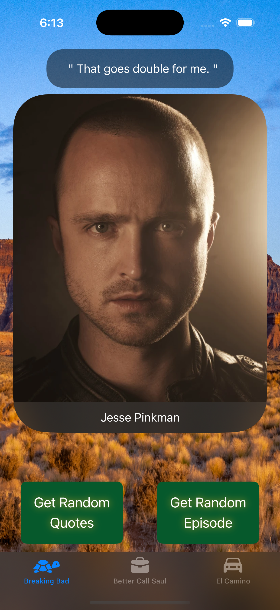
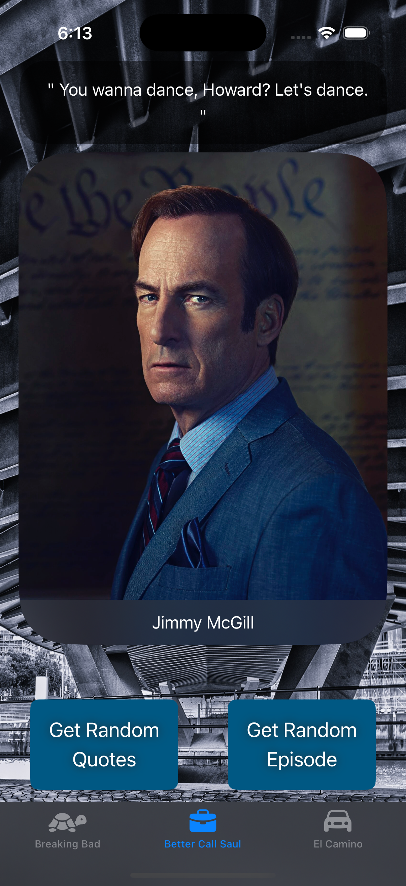
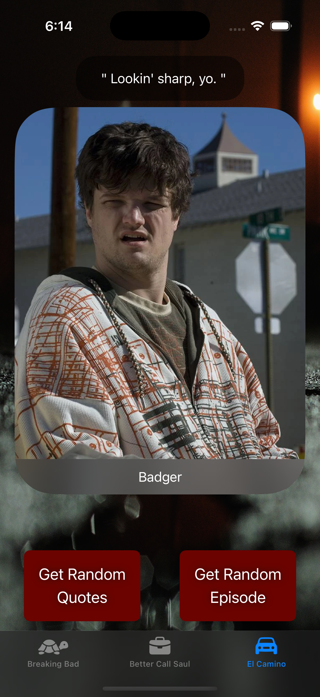
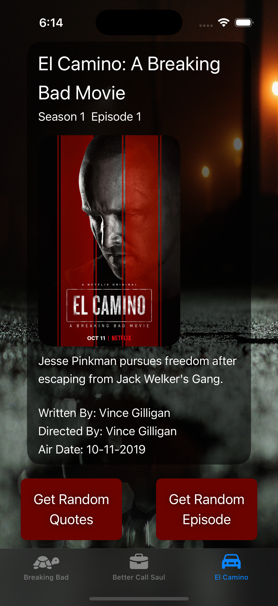

# BBQuotes – Breaking Bad & Better Call Saul Quotes iOS App

BBQuotes is a modern SwiftUI-based iOS application that delivers memorable quotes, character details, episode information, and death records from the iconic TV shows *Breaking Bad* and *Better Call Saul*.

The app demonstrates modern iOS development practices including **Swift Concurrency (async/await)**, **MVVM architecture**, and **reactive state management using the Observation framework**. Data is dynamically fetched from a REST API and displayed through a clean, responsive SwiftUI interface.

This project is designed as a **portfolio-grade application** showcasing scalable architecture, maintainable code structure, and modern Apple development patterns.

---

## Screenshots

<table align="center">
  <tr>
    <td align="center">
      <br/>
      <b>BB Random Quotes</b>
    </td>
    <td align="center">
      <br/>
      <b>BB Random Episode</b>
    </td>
  </tr>
  <tr>
    <td align="center">
      <br/>
      <b>BCS Random Quotes</b>
    </td>
    <td align="center">
      <br/>
      <b>BCS Random Episode</b>
    </td>
  </tr>
   <tr>
    <td align="center">
      <br/>
      <b>Al Camino Random Quotes</b>
      </td>
    <td align="center">
      <br/>
      <b>Al Camino Movie Screen</b>
    </td>
  </tr>
</table>

---

# Features

### Random Quote Generator
- Fetches and displays **random quotes** from characters across both series.
- Allows fans to revisit memorable dialogue from the shows.

### Character Profiles
- Explore detailed information about characters including:
  - Character name
  - Portrayal
  - Status
  - Associated death events

### Episode Guide
- Browse through episode details including:
  - Episode title
  - Season and episode number
  - Brief description

### Death Records
- View major character deaths along with details such as:
  - Responsible character
  - Episode reference

### Modern Networking
- Uses **Swift async/await** for efficient asynchronous API requests.

### Reactive UI Updates
- Uses Apple’s **Observation Framework (`@Observable`)** for automatic UI updates.

---

# Tech Stack

| Technology | Purpose |
|------------|--------|
| Swift | Core programming language |
| SwiftUI | Declarative UI framework |
| MVVM | Application architecture |
| URLSession | Network communication |
| JSONDecoder | Parsing API responses |
| Swift Concurrency | Async networking using `async/await` |
| Observation Framework | Reactive state management |

---

# Architecture

The application follows the **MVVM (Model-View-ViewModel)** design pattern to ensure separation of concerns and maintainability.

### Models
Data models representing API entities:
- `Quote`
- `Character`
- `Episode`
- `Death`

### ViewModel
The ViewModel acts as the bridge between the UI and the networking layer.

Responsibilities include:
- Fetching API data
- Managing loading states
- Handling error states
- Providing observable data to SwiftUI views

### Views
SwiftUI views responsible for rendering UI components such as:

- `QuoteView`
- `CharacterView`
- `EpisodeView`

Views automatically update when the ViewModel state changes.

### Networking Layer
A dedicated `FetchService` handles API calls using **URLSession and async/await**, ensuring clean and reusable networking logic.

---

# Project Structure

```
BBQuotes
│
├── Models
│   ├── Quote.swift
│   ├── Character.swift
│   ├── Episode.swift
│   └── Death.swift
│
├── ViewModels
│   └── ViewModel.swift
│
├── Views
│   ├── QuoteView.swift
│   ├── CharacterView.swift
│   └── EpisodeView.swift
│
├── Services
│   └── FetchService.swift
│
└── BBQuotesApp.swift
```

---

# Requirements

- iOS 17.0+
- Xcode 15+
- Swift 5.9+

---

# API Reference

This application uses the **Breaking Bad API**.

Base URL:

```
https://breaking-bad-api-six.vercel.app/api
```

### Endpoints Used

| Endpoint | Description |
|--------|-------------|
| `/quotes` | Retrieve random quotes |
| `/characters` | Fetch character details |
| `/episodes` | Retrieve episode information |
| `/deaths` | Retrieve death records |

---
